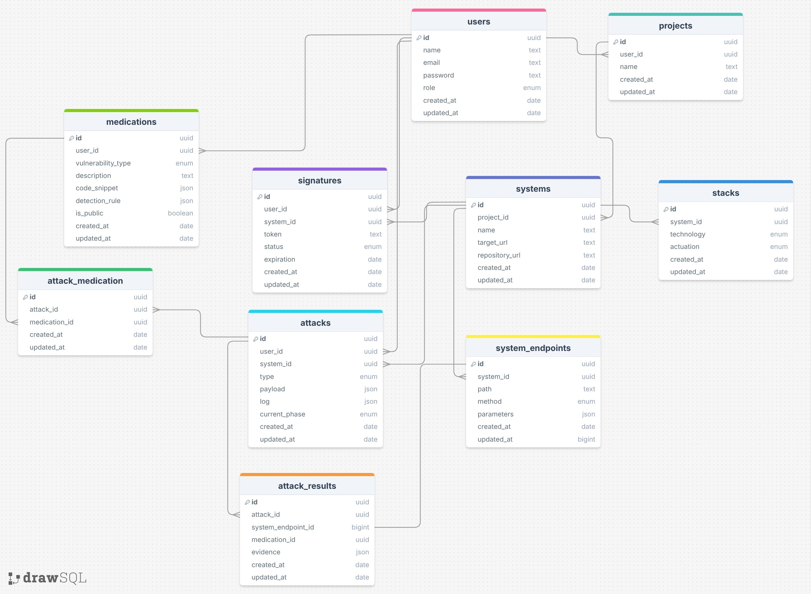

# Shingeki Mobile

## Sobre o app

Aplicação mobile focada no gerenciamento e simulação de testes de segurança em sistemas. Com funcionalidades de autenticação e ataques simulados. O aplicativo permite que o usuário gerencie tudo em projetos, adicione os sistemas alvos juntamente com sua stack, apos a validação de pose do sistema o mesmo faz simulações de ataques que geram logs básicos de auditoria.

### Funcionalidades Básicas (Prioritárias)
*Acompanhamento do desenvolvimento a cada Checkpoint:*

- [ ] **Autenticação de Usuário:** Login e cadastro seguro para acesso à plataforma.
- [ ] **CRUD de Projetos:** Gerenciamento dos projetos que englobam os sistemas.
- [ ] **CRUD de Sistemas:** Cadastro e manutenção dos sistemas alvo.
- [ ] **CRUD de Stacks:** Criação, leitura, atualização e exclusão das tecnologias utilizadas.
- [ ] **Validação de Posse:** Mecanismo para confirmar se o sistema alvo realmente pertence ao usuário logado antes de qualquer interação crítica.
- [ ] **Simulação de Ataque:** Funcionalidade para disparar um ataque contra o sistema validado.
- [ ] **Geração de Logs Básicos:** Registro simples em log dos ataques realizados nos sistemas.

---

## Protótipos de tela

O design do aplicativo segue padrões de Design System e boa usabilidade para os usuários. 

**Link para visualização:**
[Protótipo Figma](https://www.figma.com/design/uWGP5doMAqxDebsv9FYJOO/shingeki?node-id=1-3&t=galdGjExd2ltI9uO-1)

**Mapa de Telas (Visual):**

---

## Modelagem do banco

O aplicativo atua como um cliente que consome uma **API externa**, logo a persistência de dados do Shingeki Mobile não ocorre localmente.

O diagrama abaixo representa a modelagem do banco de dados relacional

**Diagrama**
[Visualizar Diagrama Entidade-Relacionamento](https://drawsql.app/teams/utfpr-14/diagrams/shingeki)

**Diagrama (Imagem):**

---

## Planejamento de sprints

**Sprint 1: Base e Autenticação (Duração: 1 Semana)**
- Configuração inicial do projeto mobile e roteamento.
- Integração de consumo da API Laravel (Setup do HTTP Client).
- Implementação da interface e lógica de Autenticação (Login/Cadastro).
- Armazenamento local do token de sessão.
- Criação de testes unitários e integração para todas as funções acima

**Sprint 2: Cadastros Base - Projetos e Sistemas (Duração: 1 Semana)**
- Desenvolvimento das telas de listagem, criação e edição de Projetos.
- Integração do CRUD de Projetos com a API.
- Desenvolvimento das telas de listagem, criação e edição de Sistemas.
- Integração do CRUD de Sistemas com a API.
- Criação de testes unitários e integração para todas as funções acima

**Sprint 3: Estrutura das Stack - Stacks (Duração: 1 Semana)**
- Desenvolvimento das telas de listagem, criação e edição de Stacks.
- Integração do CRUD de Sistemas com a API.
- Criação de testes unitários e integração para todas as funções acima

**Sprint 4: Funcionalidades principais - Validação e Ataque (Duração: 2 Semanas)**
- Implementação da interface da página de detalhes do Sistema.
- Desenvolvimento da funcionalidade de "Validação de Posse" (fluxo de confirmação via API).
- Desenvolvimento da função de "Atacar Sistema".
- Captação da resposta da API e exibição dos logs básicos gerados pelo ataque.
- Criação de testes unitários e integração para todas as funções acima

**Sprint 5: Refinamento e Entrega Final (Duração: 0,5 Semanas)**
- Polimento de UI/UX (tratamento de erros, loading states, feedbacks visuais).
- Atualização final da documentação e preparação para a apresentação.
